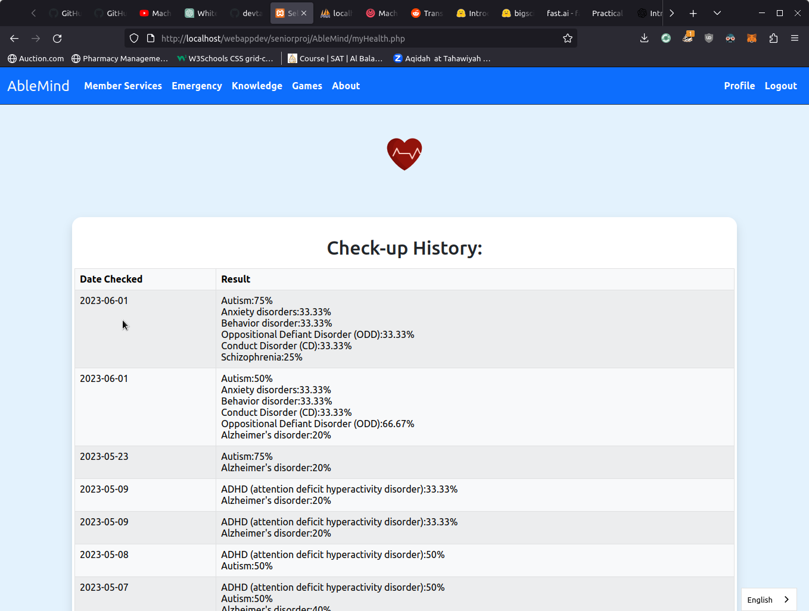
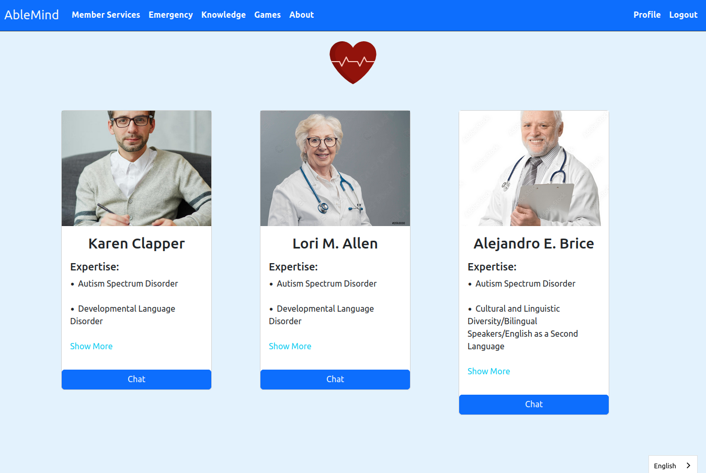
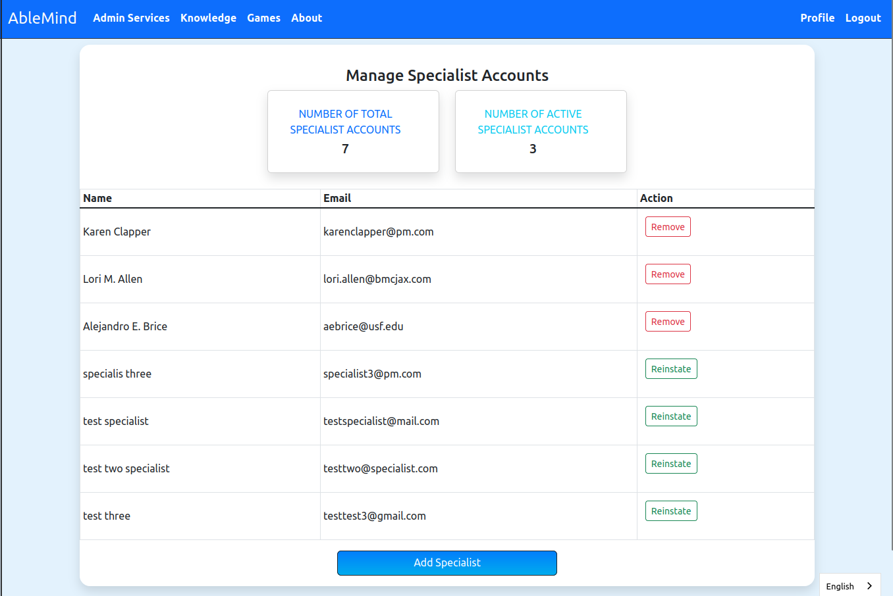
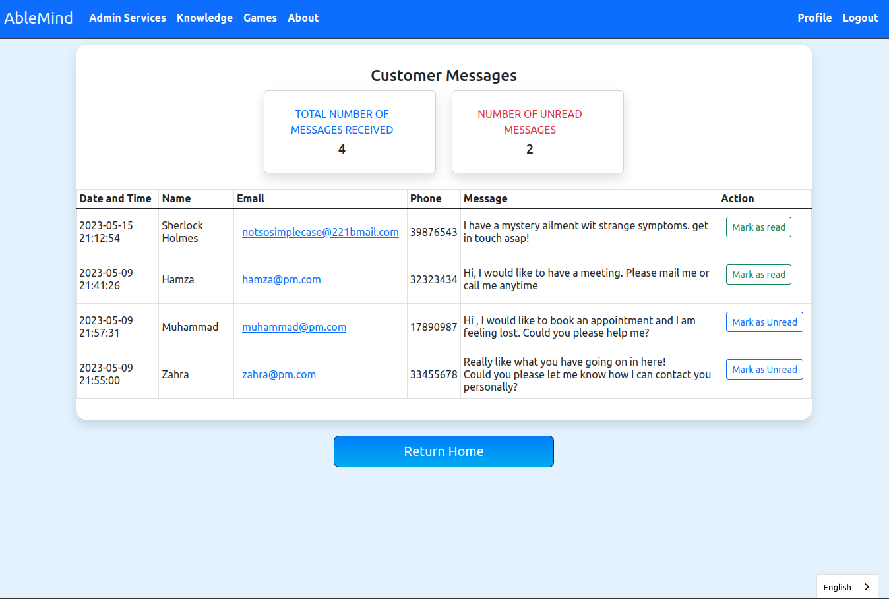

# HealthMentor

Diagnose mental disorders and receive recommended treatments  along with being able to chat wth the specialists. Admin can log in and perform management tasks for users, disorders, specialists, and more.

**Hosted at**: [http://healthmentor.infinityfreeapp.com](http://healthmentor.infinityfreeapp.com/login.php?fillemail=maximus1@gmail.com&fillpwd=Max12345)

## Features

### Guest and member users can perform self-checkup and receive recommended treatments and specialists.

https://github.com/devtahmid/HealthMentor/assets/27241074/cd90350e-ed60-498e-b06d-8eeb8c2cd4bf

### Members can view their checkup history

### Members can chat with specialists

### Admin can add and manage disorders in the DB

https://github.com/devtahmid/HealthMentor/assets/27241074/914f9dc6-d907-4859-85e9-5d7893517218

### Admin can add and manage specialists in the DB

### Admin can read feedback submitted by users in contact.php

